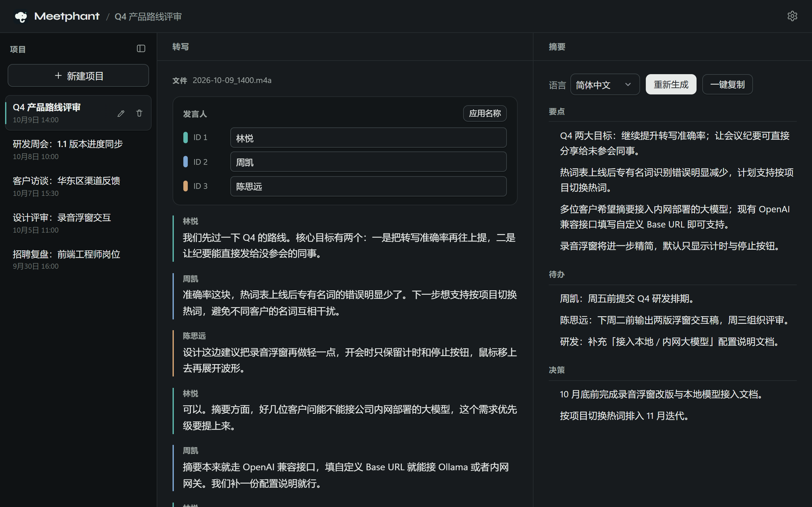
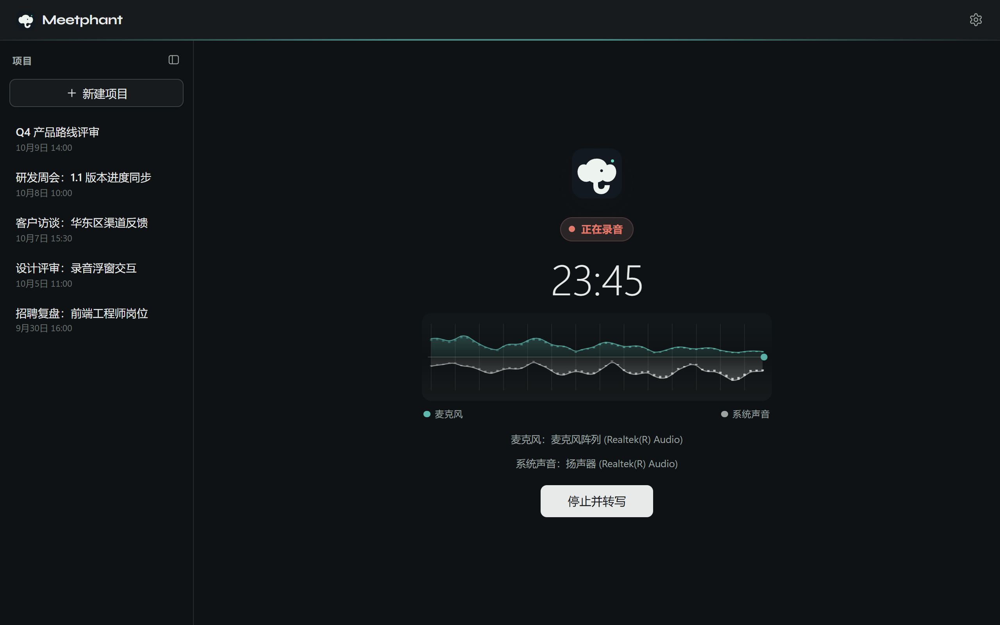
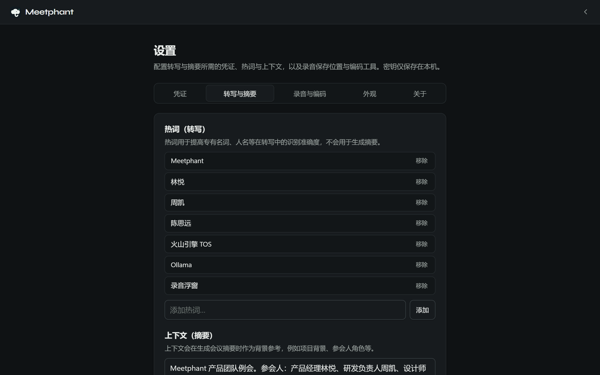
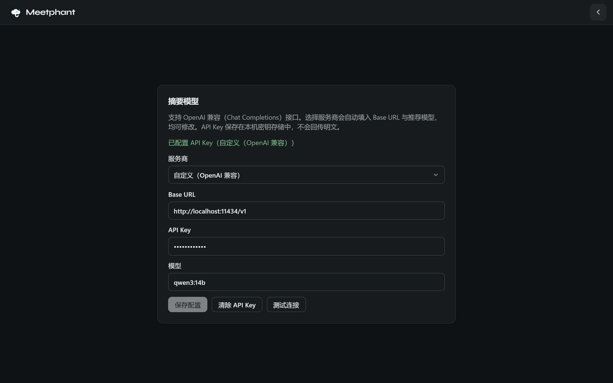

<div align="center">


# Meetphant 会议助手

**大象从不遗忘。** 把会议录音变成可带走的纪要。

录制或导入音频 → 自动转写 → 整理出要点、待办与决策。

[](https://github.com/leoshcn/meetphant/releases/latest)
[](https://github.com/leoshcn/meetphant/releases/latest)
[](./LICENSE)
[](https://tauri.app/)

[**下载 Windows 版**](https://github.com/leoshcn/meetphant/releases/latest) · [产品官网](https://leoshcn.github.io/meetphant/) · [English](./README.md)



</div>

## 为什么选 Meetphant

Meetphant 是一款免费开源、本地优先的 Windows 桌面会议助手。它独立于你正在用的会议软件运行——不需要机器人入会，不需要插件，也不需要主持人权限。

|  |  |
|---|---|
| 🎙️ **任何会议都能录** | 同时录制麦克风与系统声音，腾讯会议、飞书、Zoom、Teams 或线下会议室都适用 |
| 🧠 **热词越用越懂你** | 人名、客户名、产品名随每次转写请求一并提交，识别更准 |
| 🔒 **纪要由你做主** | 摘要支持任意 OpenAI 兼容模型，云端或本地大模型（如 Ollama）均可 |
| 📋 **纪要拿来就能用** | 要点 · 待办 · 决策，支持中文、英文或中英双语 |
| 💾 **本地优先** | 会议与设置存 SQLite；API Key 只进系统钥匙串 |

## 功能介绍

### 01 · 独立录制，不被会议平台绑定



- 一键同时录制麦克风与系统声音（WASAPI loopback）
- 双轨电平实时可见，录没录上一眼便知
- 已有录音？直接导入 `wav`、`mp3`、`m4a`、`flac`、`ogg`、`aac`
- 有 FFmpeg 时保存为 M4A，没有则自动以 WAV 兜底，不耽误录音

### 02 · 自定义热词，越用越懂你



- 同事姓名、客户名称、项目代号，一次添加长期生效
- 热词只作用于转写；摘要另有「上下文」设置提供背景信息
- 自动区分发言人，并可重命名，纪要里直接显示真实称呼

### 03 · 可连接本地大模型，纪要由你做主



- 内置 **阿里云百炼 DashScope（通义千问，默认）**、DeepSeek、OpenAI、Moonshot（Kimi）、智谱 BigModel、火山方舟（豆包）预设
- 也可填写自定义端点，例如 `http://localhost:11434/v1`，连接本机 Ollama 或公司内网部署的模型
- 连接本地模型时，生成摘要不必把会议内容交给第三方 AI 服务
- API Key 只存入系统钥匙串，不写入数据库，也不会回显明文

> [!NOTE]
> 语音转写目前使用云端的 **豆包录音文件识别模型 2.0**，音频需经 **你自己的** 火山引擎 TOS 存储桶上传。

### 更多能力

- **结构化摘要**：直接回答「谈了什么、谁做什么、定了什么」
- **工作区**：侧栏会议列表 + 转写 / 摘要分栏（窄窗口自动切换为标签页）
- **浅色 / 深色主题**：跟随系统，或手动指定
- **自动更新**：启动时检查新版本，一键下载、安装并重启

## 三步，从录音到纪要

| 步骤 | | |
|:---:|---|---|
| **1** | **录制或导入** | 开会时一键录下麦克风与系统声音，或导入已有的会议音频 |
| **2** | **自动转写** | 停止录音即自动建会并转写，区分发言人，热词让专有名词更准确 |
| **3** | **生成摘要** | 一键整理要点、待办与决策，复制即可分享 |

## 下载安装

前往 [**Releases**](https://github.com/leoshcn/meetphant/releases/latest) 下载最新安装包（Windows 10 / 11，x64）。

| 安装包 | 内容 | 适用场景 |
|---|---|---|
| `Meetphant_<ver>_x64-setup.exe`（**精简版**，推荐） | 仅应用 | 日常安装；首次需要时再下载 FFmpeg（约 80–100 MiB）；支持应用内自动更新 |
| `Meetphant_<ver>_x64-offline-setup.exe` | 应用 + 内置 FFmpeg | 弱网 / 离线环境（需手动更新） |

两者使用同一应用 ID，安装其一会替换另一个。

## 首次配置

打开 **设置**，填写三类凭证：

| 用途 | 服务 | 需要填写 |
|---|---|---|
| 转写 | 豆包语音 | API Key（豆包语音新版控制台） |
| 转写音频上传（必需） | 火山引擎 TOS | AK / SK + region / bucket |
| 摘要 | 通义千问 / DashScope（默认）或其他 OpenAI 兼容服务 | 服务商、Base URL、API Key、模型 |

凭证只保存在系统钥匙串中，**不会**写入 SQLite，也**不会**被 `settings_get` 回传。

📖 不知道怎么申请？请看图文指南：**[凭证申请图文指南（小白版）](./docs/credentials-guide.zh-CN.md)**（豆包 ASR、火山 TOS、通义千问 API Key）

<details>
<summary><b>转写限制</b></summary>

| 文件大小 | 处理方式 |
|---|---|
| ≤ 512 MiB（≤ 5 小时） | 上传 TOS → 预签名 URL → 豆包录音文件识别 2.0 提交 / 查询（`volc.seedasr.auc`，最长轮询 45 分钟） |
| > 512 MiB | 拒绝并返回 `ASR_PAYLOAD_TOO_LARGE` |

热词会发送给 ASR；`context_text` 仅用于摘要，**不会**发送给豆包 ASR。

</details>

## 开发

**环境要求**

- [Node.js](https://nodejs.org/) 20+
- [Rust](https://rustup.rs/) stable——Windows 请使用 MSVC：`rustup default stable-x86_64-pc-windows-msvc`
- Windows：[Visual Studio Build Tools](https://visualstudio.microsoft.com/visual-cpp-build-tools/)（「使用 C++ 的桌面开发」）+ WebView2（Win10/11 通常已预装）

```bash
npm install
npm run tauri dev        # Vite 运行在 http://localhost:1420，并打开 Meetphant 窗口
```

```bash
npm test                 # 前端测试（Vitest）
npm run typecheck
cd src-tauri && cargo test
```

```
src/          React 界面（app / pages / features / ipc / shared）
src-tauri/    Tauri 命令、服务、SQLite、供应商适配
website/      产品官网（纯 HTML/CSS，中文 /，英文 /en/）
scripts/      安装包打包、FFmpeg 准备、截图生成
```

<details>
<summary><b>打包与发布</b></summary>

```bash
npm run ffmpeg:prepare   # 缓存固定版本的 FFmpeg essentials 构建
npm run pack:lean        # 精简包
npm run pack:offline     # 离线包
npm run pack:all         # 两者 → dist-installers/（签名后含 latest.json）
```

推送版本 tag（或在 **Actions → Release** 手动运行）即可由 CI 构建两个 `.exe` 与 `latest.json` 并上传到 GitHub Release。

**自动更新**

- 应用启动时及在 **设置 → 关于** 中检查 `https://github.com/leoshcn/meetphant/releases/latest/download/latest.json`。
- 更新通道只发布 **精简版** 安装包。
- Release 构建需使用 Tauri updater 私钥签名：
  - 本地：设置 `TAURI_SIGNING_PRIVATE_KEY` 或 `TAURI_SIGNING_PRIVATE_KEY_PATH`（可选 `TAURI_SIGNING_PRIVATE_KEY_PASSWORD`）
  - CI：仓库 Secrets `TAURI_SIGNING_PRIVATE_KEY` 与可选的 `TAURI_SIGNING_PRIVATE_KEY_PASSWORD`
- 密钥只需生成一次：`npm run tauri signer generate -- -w ~/.tauri/meetphant.key`；私钥请离线保管，公钥已写入 `src-tauri/tauri.conf.json`。
- Windows Authenticode / SmartScreen 代码签名尚未配置（与 Tauri 更新签名无关）。

内置的 FFmpeg 为 Gyan **essentials** 构建（GPLv3），见 [GyanD/codexffmpeg](https://github.com/GyanD/codexffmpeg)。

</details>

<details>
<summary><b>官网与截图</b></summary>

产品官网位于 `website/`，纯 HTML/CSS，无构建步骤（中文 `/`，英文 `/en/`）。

```bash
npx serve website        # 或：py -3 -m http.server -d website 8000
npm run screenshots      # 重新生成 website/assets/screenshots/*.png 与 og.png
```

`npm run screenshots` 用无头 Chromium + 模拟的 Tauri IPC 与示例数据渲染真实的 React 界面（`scripts/screenshots/`）。界面改动后请重跑并提交截图——本 README 也引用这些图片。

推送到 `main` 且改动 `website/**` 时，由 `.github/workflows/pages.yml` 自动发布。首次需手动开启：仓库 **Settings → Pages → Source 选 GitHub Actions**。

</details>

## 技术栈

Tauri 2 · React 19 · TypeScript · Vite · Rust · SQLite · 豆包录音文件识别 2.0 · OpenAI 兼容大模型 · 系统钥匙串

## 开源协议

[MIT](./LICENSE) © 2026 Leo Li——可自由使用、修改与分发。

<div align="center">
<sub>🐘 下一场会议，让大象帮你记。</sub>
</div>
